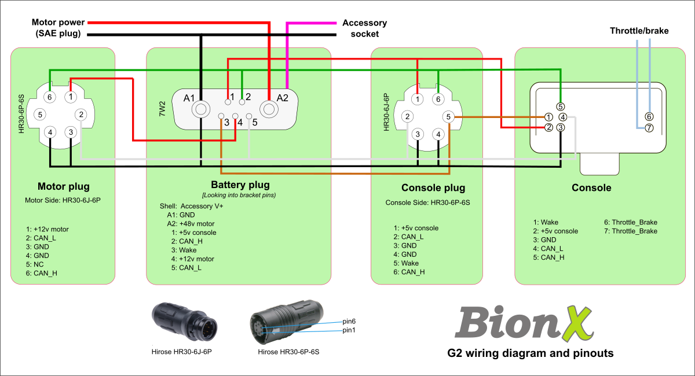

# BionX CANBus Protocol Specification

The BionX system communicates over CANBus (125kbps), with the Console typically acting as the Bus Master.

## Node Network

| Node Name | Node ID (Master) | Node ID (Slave) | Description |
| :--- | :--- | :--- | :--- |
| **Console** | `0x08` | `0x48` | The master controller and display unit. |
| **Battery** | `0x10` | `0x50` | The Battery Management System (BMS). |
| **Motor**   | `0x20` | `0x60` | The motor controller (integrated in the hub). |
| **BIB**     | `0x58` | `0x58` | BionX Interface Box (for PC diagnostic tools). |

---

## Packet Format

BionX uses standard CAN 2.0A frames with 11-bit identifiers. In normal operation
all Query and Set packets are sent from the console. The battery and motor never
initiate communication.

### 1. Query Register (REQ)
Requests the value of a specific register from a node.
- **CAN ID**: Target Node ID (e.g., `0x10` for Battery)
- **DLC**: `2`
- **Data**: `[0x00, Register_ID]`

### 2. Reply Register (RESP)
Sent by a node in response to a Query.
- **CAN ID**: Requester Node ID (typically `0x08` for Console)
- **DLC**: `4`
- **Data**: `[0x00, Register_ID, 0x00, Value]`

### 3. Set Register (SET)
Command to change a register value on a target node.
- **CAN ID**: Target Node ID
- **DLC**: `4`
- **Data**: `[0x00, Register_ID, 0x00, New_Value]`

---

## Key Registers

For full details, see [registers.h](registers.h).

### Console Registers (`0x08` / `0x48`)
| ID | Name | Description | Unit/Format |
| :--- | :--- | :--- | :--- |
| `0x64-67` | `REG_CONSOLE_STATISTIC_ODOMETER_*` | Total system distance. | 0.1 km |
| `0x81-82` | `REG_CONSOLE_GEOMETRY_CIRC_*` | Wheel circumference for speed calculation. | mm |
| `0x84-85` | `REG_CONSOLE_ASSIST_MAXSPEED_*` | Assist speed limit. | 0.1 km/h |
| `0x87-88` | `REG_CONSOLE_THROTTLE_MAXSPEED_*`| Throttle speed limit. | 0.1 km/h |
| `0x8A`    | `REG_CONSOLE_ASSIST_MINSPEED` | Minimum speed required for assist. | 0.1 km/h |
| `0xB4`    | `REG_CONSOLE_ASSIST_INITLEVEL` | Default assist level on power-up (0-4). | Raw |
| `0xD1`    | `REG_CONSOLE_STATUS_SLAVE` | Write `1` to force console into slave mode. | Boolean |

### Battery Registers (`0x10` / `0x50`)
| ID | Name | Description | Unit/Format |
| :--- | :--- | :--- | :--- |
| `0x1E-1F` | `REG_BATTERY_STATUS_CELLPACK_CURRENT_*` | Real-time current flow (signed). | 0.001 A |
| `0x25`    | `REG_BATTERY_CONFIG_SHUTDOWN` | Write `1` to trigger system power-off. | Trigger |
| `0x28`    | `REG_BATTERY_CONFIG_ACCESSORY_VOLTAGE` | Accessory port output voltage. | 0.1 V |
| `0x32`    | `REG_BATTERY_STATUS_BATTERY_VOLTAGE_NORMALIZED` | Normalized battery voltage (3.7V/cell ref). | % |
| `0x61`    | `REG_BATTERY_STATUS_CHARGE_LEVEL` | Current State of Charge (SoC). | 6.66 % |
| `0x66-69` | `REG_BATTERY_STATUS_TEMPERATURE_SENSOR_*` | Temperature sensors 1-4. | °C |
| `0xA6-A7` | `REG_BATTERY_STATUS_BATTERY_VOLTAGE_HI` | Absolute battery pack voltage. | 0.001 V |

### Motor Registers (`0x20` / `0x60`)
| ID | Name | Description | Unit/Format |
| :--- | :--- | :--- | :--- |
| `0x09`    | `REG_MOTOR_ASSIST_LEVEL` | Current motor assistance level. | 1.5625 % |
| `0x11`    | `REG_MOTOR_STATUS_SPEED` | Motor rotational speed. | rpm |
| `0x14`    | `REG_MOTOR_STATUS_POWER_METER` | Power output being delivered. | 1.5625 % |
| `0x16`    | `REG_MOTOR_STATUS_TEMPERATURE` | Internal motor temperature. | °C |
| `0x21`    | `REG_MOTOR_TORQUE_GAUGE_VALUE` | Raw signal from the torque sensor. | 1.5625 % |
| `0x8B`    | `REG_MOTOR_ASSIST_MAXSPEED` | Speed limit of the motor. | kph |

---

## System Operation Sequence

Analysis of the CANBus traffic reveals a structured sequence for system startup, steady-state
operation, and shutdown.

### 1. Power-On & Initialization
When the system is powered on, the Console (acting as Master) orchestrates the following handshake:

#### Phase A: Battery Initialization
1.  **Wake-up**: Console sends `SET REG_BATTERY_ALARM_ENABLE = 0` (Alarm off) and `SET REG_BATTERY_CONFIG_POWER_VOLTAGE_ENABLE (0x21) = 1` to enable the high-voltage power rail.
2.  **Identification**: Console queries `REG_BATTERY_REV_HW (0x3B)` and `REG_BATTERY_REV_SW (0x3C)`.
3.  **Config**: Console sets `REG_BATTERY_CONFIG_ACCESSORY_ENABLED (0x22)` and queries `REG_BATTERY_CONFIG_TYPE (0x3D)`.

#### Phase B: Motor Initialization
1.  **Wake-up**: Console sends `SET REG_MOTOR_SET_WAKEUP = 0`, `SET REG_MOTOR_SET_3KMH = 0`, and `SET REG_MOTOR_ASSIST_DIRECTION (0x42) = 1` (Clockwise).
2.  **Identification**: Console queries `REG_MOTOR_REV_SW (0x20)`.
3.  **Sensor Check**: Console queries `REG_MOTOR_TORQUE_GAUGE_TYPE (0x6C)`.

#### Phase C: Limit Synchronization
To ensure system safety, the Console mirrors Battery limits to the Motor:
1.  **Read Battery**: Queries `REG_BATTERY_CONFIG_MAX_CHARGE_HI/LO (0xF9/0xFA)` and `MAX_DISCHARGE_HI/LO (0xFB/0xFC)`.
2.  **Unlock Motor**: Sends `SET REG_MOTOR_PROTECT_UNLOCK (0xA5) = 0xAA`.
3.  **Write Motor**: Sets `REG_MOTOR_CONFIG_MAX_DISCHARGE_HI/LO (0x7A/0x7B)` and `MAX_CHARGE_HI/LO (0x7C/0x7D)` to match battery capabilities.

### 2. Main Operation Loop (Steady State)
Once initialized, the Console enters a high-frequency control loop (approx. **60ms to 100ms** interval).

*   **Input Sampling**: The Console continuously queries:
    *   `REG_MOTOR_TORQUE_GAUGE_VALUE (0x21)` (Rider effort)
    *   `REG_MOTOR_STATUS_SPEED (0x11)` (Bike speed)
    *   `REG_MOTOR_STATUS_POWER_METER (0x14)` (Current assist level)
*   **Control Output**: Based on the inputs and user assist level (0-4), the Console sends:
    *   `SET REG_MOTOR_ASSIST_LEVEL (0x09)` (Calculated assistance %)
    *   `SET REG_MOTOR_ASSIST_WALK_LEVEL (0x0A)` (Throttle/Walk assist)
*   **Health Monitoring**: At a lower frequency (interleaved in the loop), the Console queries:
    *   Battery Normalized Voltage (`0x32`) and absolute Voltage (`0xAA`)
    *   Cellpack Current Flow (`0x1E`, `0x1F`)
    *   Internal Temperatures (`0xE1`, `0xE2` Battery, `0x16` Motor)
    *   RTC Time (`0xA1-0xA4`) and State of Charge (`0x30`, `0x61`)

### 3. Power-Off Sequence
Triggered by a long-press on the Console or a system timeout:
1.  **Stop Motor**: Sends `SET REG_MOTOR_ASSIST_LEVEL (0x09) = 0`.
2.  **Motor Standby**: Sends `SET REG_MOTOR_SET_3KMH = 0` and `SET REG_MOTOR_ASSIST_DIRECTION (0x42) = 1`.
3.  **BMS Shutdown**: Sends `SET REG_BATTERY_CONFIG_SHUTDOWN (0x25) = 1`. The Battery Management System then cuts the high-voltage rail and enters a low-power sleep state.

---

## Register Protection
Critical registers (like speed limits or battery configuration) are often protected.
To modify a protected register:
1.  Write to the node's `UNLOCK` register (e.g., `0xA5` on Motor, `0x71` on Battery).
2.  Write the new value to the target register.

The value to send to the `UNLOCK` register depends on the component. For the
motor, you must send `0xAA` which will unlock for 30 seconds. For the battery,
the unlock takes effect for however many seconds you send. Note that there
are some magic values for the battery that may affect the firmware, so avoid
sending anything over 0x54.

