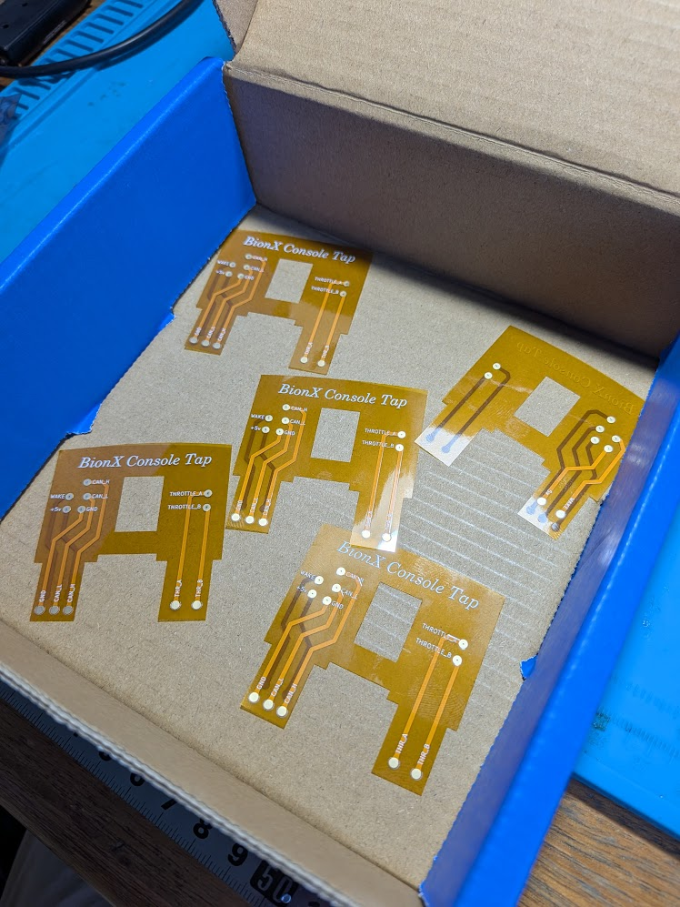
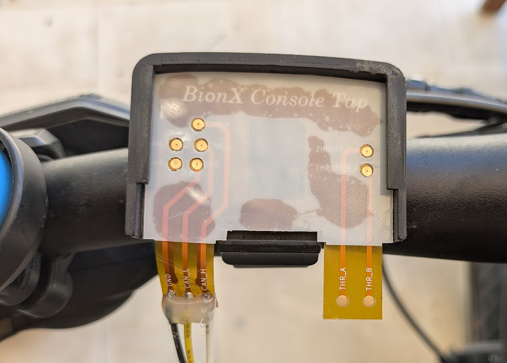
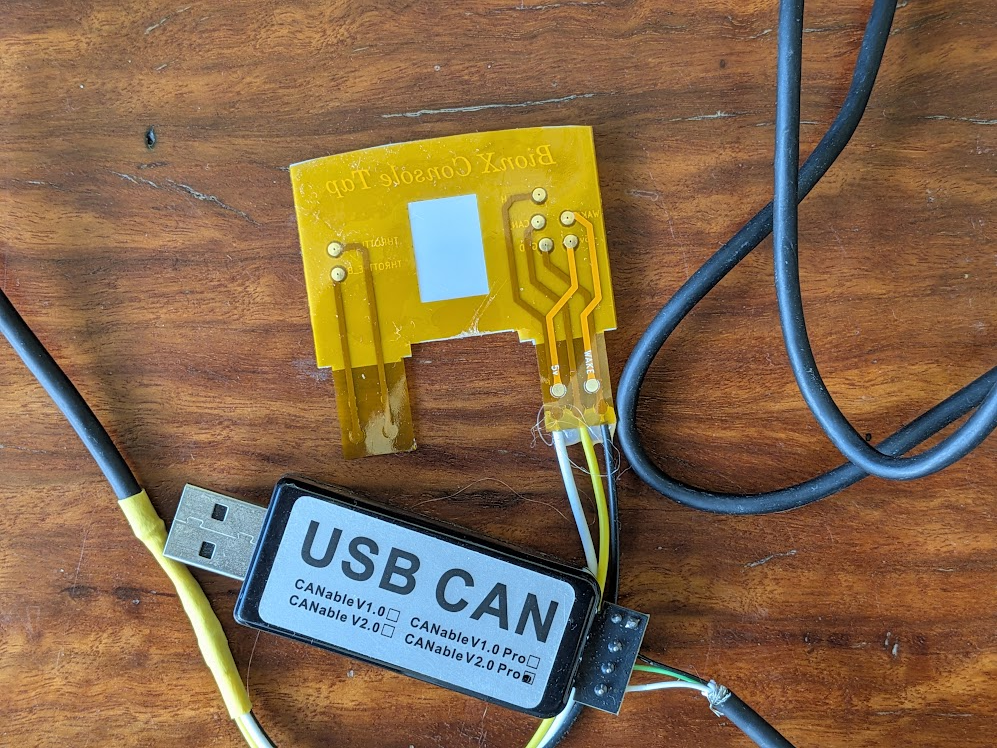
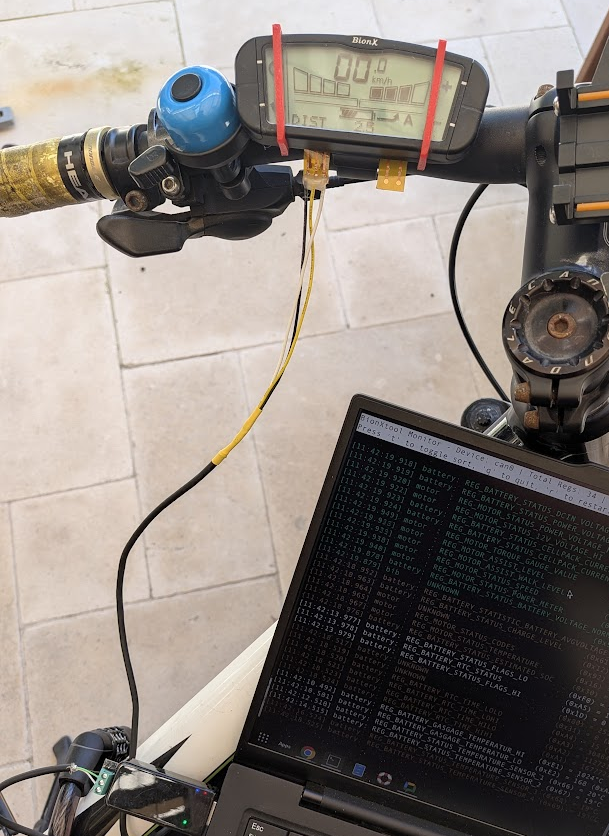

# Bionx Console Adapter

This contains Kicad designs for a flex PCB that can be slotted under the
G2 console for easy interfacing with the bike's CAN bus.

The PCB breaks out all of the pins from the console (including throttle).

## Manufacture

The file `gerbers.zip` contains all of the necessary fab files and it
can be uploaded directly to JLCPCB and other board houses, with no
further changes necessary.

JLCPCB currently has a deal where you can get 5 x flex PCBs for $2,
and if you use their lowest cost shipping option, you can get these
delivered for a total of around $5-6.

Five easy steps to order:

1. Go to [JLCPCB](https://jlcpcb.com/)
2. Click on the *Get Instant Quote* button (no need to change the options next to it).
3. Click *Add gerber file* and upload the _gerbers.zip_ file from here.
4. Select *Flex* as the base material. You will see a yellow render of the PCB.
5. Change no other options, just click *Save to cart* and finalise the order.

If you select *Global Standard Direct Line* shipping, this will cost a
little over $3, rather than $20+ for DHL/Fedex, though will take a couple
of weeks.

The $2 deal is for 0.11mm PCB - thicker options are much more expensive,
but this one works (you may want to manually add a stiffening film).

## Usage

The PCB simply slips into the console holder, ensuring the PCB pads line
up with the metal pads, then slide the console on, taking care not to
let the PCB slip.

On mine, I added a little extra rigidity by using some 0.2mm mylar
sheet that I cut and added holes for the PCB pads, using contact cement
to bond them together. You don't have to do this, but you need to
be a little careful at preventing the PCB from slipping.

You can then solder wires to the GND, CAN_L and CAN_H pads, which you
then connect to your CANBus adapter. I used soft silicone wire and hot
glue - more rigid wire and/or no hot glue risks tearing the pads off.

The other pins are also broken out for those who want to experiment more.

